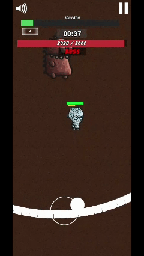

# 🧊 Ice Defender - 2D Survival Game (Client Project)

This is a 2D mobile game I developed for a freelance client.  
Players fight off endless waves of enemies, upgrade characters, and defeat bosses in timed levels.

## 🔧 Built With
- Unity (C#)
- Custom AI system
- Shop and upgrade system
- Mobile-optimized interface

## 📸 Screenshots

> These images represent the actual game delivered to the client:

## 🔒 Project Status
- ✅ Delivered and approved by the client  
- 🔐 Code is private due to client confidentiality  
- 📂 Demo video is currently not available
